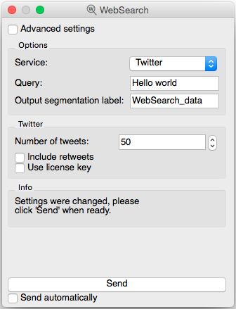
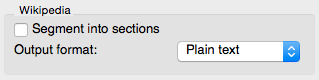
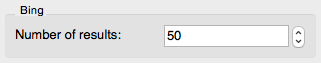
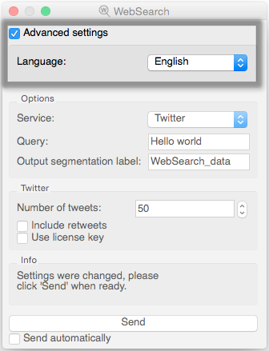

##################################
WebSearch
##################################

1. Signals
**************
Inputs : None

Outputs : WebSearch_data (by default)

2. Description
**************
The WebSearch widget is designed for the Orange Canvas environment to generate textual data retrieved from Twitter, Wikipedia or Bing. 
Depending on the service, the output segmentation has the following annotations with keys :

* Twitter : date, source, search, url and author.
* Wikipedia : source and search.
* Bing : url, source, search and title.

The interface of WebSearch adapts itself to the selected service. If the **Advanced settings** checkbox is selected, more options are revealed.

2.1 Basic Interface
**************
As stated before, the basic interface is dependant of the selected service. In case Twitter is chosen, the interface looks like this :

Figure 1 : WebSearch widget with Twitter selected (basic interface)

The **Service** field allows the user to select a search engine (Twitter, Wikipedia or Bing).

The **Query** field contains the searched word(s) on the chosen web engine. By default, the language is set to English. To learn how to change it : read 2.2.

By default, the **Output segmentation label** is named `WebSearch_data`. Users can however modify it if needed. 

Clicking on the **Send** button executes the request. The **Info** box above indicates the number of segments sent (in case any match the request). More informations about the **Info** box : read 3.

Depending on which search engine is selected, different options appear on the basic interface. Those specific aspects are stated below.

2.1.1 Twitter
~~~~~~~~~~~~~~~~~~
The **Number of tweets** field allows users to retrieve up to 3000 tweets, in case the request matches as many tweets as required by the entered number.  

When **Include retweets** is checked, tweets starting with 'RT' are filtered out in order to only send "original" tweets to output. It is worth noting that the number of segments in the output may, in somes cases, actually be lower than the value entered in **Number of tweets**. 

Twitter allows their users to own a license key which can be entered in the eponym field.  

2.1.2 Wikipedia
~~~~~~~~~~~~~~~~~~

Figure 2 : Wikipedia options box (basic interface)

When **Segment into sections** is checked, Wikipedia articles are divided into sections : each segment contains a section. 

The **Output format** is either "Plain text" or "HTML".

2.1.3 Bing
~~~~~~~~~~~~~~~~~~

Figure 3 : Bing options box (basic interface)

The **Number of results** field allows users to retrieve up to 1000 Bing results, in case the request matches as many results as required by the entered number.

2.2 Advanced Interface
**************
Once the **Advanced settings** checkbox is selected, a new box reveals itself on top of the window. It enables the user to choose the Language of the retrieved data. 

Figure 4 : WebSearch widget with Twitter selected (advanced interface)

3. Messages
**************
*Setting changed. Click send.*
    This message informs the user that the settings have been changed and are ready to be sent. 

*Data correctly sent to output: <n> segments.*

The data, comprises of <n> number of segments has been sent to the output correctly.

*No data sent to output.*

The search didn't retrieve any data. When confronted to this message, the user should try to simplify the query.

*Settings were changed, please click 'Send' when ready.*

Unless the **Send automatically** checkbox is selected, any changes in the settings require to click "Send".

