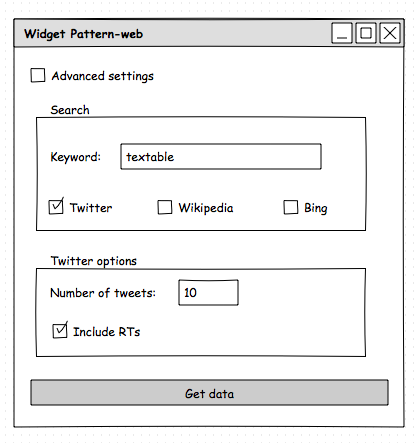

##################################
Specification: Widget Textable Pattern-web
##################################

1 Introduction
**************

1.1 But du projet
=================
Créer un Widget Textable qui a pour fonction de créer un corpus textuel généré à partir d'un mot clé donné par l'utilisateur depuis Twitter, Bing et Wikipédia. 
Dernière version en python 2 disponible

1.2 Aperçu des etapes
=====================
* Premiere version de la specification: 17 mars 2016
* Remise de la specification: 24 mars 2016
* Version alpha du projet:  28 avril 2016
* Remise et presentation du projet:  26 mai 2016

1.3 Equipe et responsabilitées
==============================

* Bassim Matar `bassim.matar@unil.ch`_ :

.. _bassim.matar@unil.ch: mailto:bassim.matar@unil.ch

    - Codage 
    - Test
    - Gestion de projet

* Taar Rusconi `taar.rusconi@unil.ch`_ :

.. _taar.rusconi@unil.ch: mailto: taar.rusconi@unil.ch

    - Documentation
    - Codage
    
    
* Cyril Nghiem `cyril.nghiem@unil.ch`_ :

.. _cyril.nghiem@unil.ch: mailto:cyril.nghiem@unil.ch

    - Design interface
    - Codage
    - Specification
    
* Jean Schuwey `jean.schuwey@unil.ch`_ :

.. _jean.schuwey@unil.ch: mailto:jean-schuwey@unil.ch

    - Codage
    - Gestion de projet

* Grégory Thonney `gregory.thonney.1@unil.ch`_ :

.. _gregory.thonney.1@unil.ch: mailto:gregory.thonney.1@unil.ch

    - Documentation
    - Specification
    - Codage

1.4 Ressources et documentations
==============================
* Documentation de Pattern-web: http://www.clips.ua.ac.be/pages/pattern-web
* Code source de Textable: https://bitbucket.org/langtech/orange-textable/src/ec4a228f683a2681c18104bee05e06d2e34a968d?at=master
* Tutoriel Orange Canvas: http://orange.biolab.si/getting-started/
* Orange Widgets Development: http://orange.biolab.si/docs/latest/extend-widgets/rst/

2. Technique
************

2.1 Mock-up de l'interface
==========================

..  
    PLUSIERUS A LA FOIS?
    (PENSEZ A POUVOIR AUGMENTER LES OPTIONS)
    (OPTIONS PAR TYPE SELECTIONNE)

    VARIABLES PAR DEFAULT TEXTABLE? (NOM DE LA SEGMENTATION)

    ADVANCED SETTINGS?

2.2 Fonctionnalités minimales
=============================
- Utiliser un mot-clé donné par l'utilisateur pour rechercher du texte via Twitter et l'afficher. L'utilisateur pourra aussi défininir le nombre de tweets à afficher.  
..
    OUTPUT ? (SEGMENTATION ANNOTATIONS)

2.3 Fonctionnalités principales
===============================
- Permettre à l'utilisateur de générer un corpus de texte depuis le contenu de la page Wikipédia du mot-clé utilisé. 
- Avec Bing, permettre à l'utilisateur d'avoir un coprus textuel généré depuis les entrées des recherches effectée sur le moteur de recherche avec le mot-clé. 

..
    OUTPUT ? (SEGMENTATION ANNOTATIONS)

2.4 Fonctionnalités optionnelles
===============================
- Permettre à l'utilisateur d'entrez une clé de licence pour Bing, Twitter, etc. 
- Indiquer à l'utilisateur le nombre de requêtes qu'il a effectées par API. 

2.5 Tests
=========
Le widget est considéré comme fonctionnel si les fonctionnalités de 2.2 à 2.4 sont remplies. 
..
    + TESTS AUTOMATIQUES

3. Etapes
*********
- Se renseigner sur les fonctionnalités de pattern et des différentes API.
- Tester indépendemment chaque fonctionnalité du widget. 
..
    DANS PYTHON SCRIPT ? OU JUSTE PYTHON ?
..    
    -    En parallel:
* Implémenter les fonctionnalités dans le widget.
* Interface graphique.
- Tests et correction. 
- Etablir la documentation du widget.

3.1 Version alpha
=================
* L'interface graphique est complétement construite.
* Les fonctionnalités minimales sont prises en charge par le logiciel.

3.2 Remise et présentation
==========================
* Les fonctionnalités principales sont complétement prises en charge par le logiciel.
* La documentation du logiciel est complète.
* Le logiciel possède des routines de test de ses fonctionnalitées (principales ou optionelles).

4. Infrastructure
=================
Le projet est disponible sur GitHub à l'adresse https://github.com/Bassim789/pattern-web/

